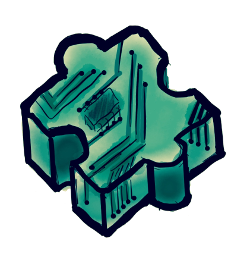

OpenVSM
=========



OpenVSM is a model sumulation engine with C and Lua API for Proteus 7/8 CAD

Documentation is here http://pugnator.github.io/openvsm

Written in C and gcc-ready (mingw/cygwin) for Linux and Windows

  - You can create your model as standalone DLL or use DLL and Lua script together
  - Function prototypes have the same syntax in both API
  - Designed with hope to make simulation as simple as possible for electronics enthusiasts


Visit 'example' directory for sample project files

Version
----
0.1

How to
--------------

  - Install mingw32 for you platform
  - Clone https://github.com/Pugnator/openvsm.git
  - Change to the cloned directory
  - Issue "make" command in Linux or "mingw32-make" under Windows
  - Copy lua53\lua.dll to %windir%\system32 directory
  - Create environment variable containing path to the script directory,
issuing the following command:

```bat
setx LUAVSM "C:\script\"
```
  - In this case you should place your model script to c:\script directory, 
  note the trailing backslash
  - Your script should be named after the name of model DLL, for example:

```model.dll
model.dll.lua```

License
----

GPL v2


**Free Software**
